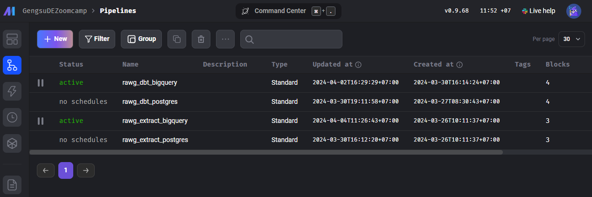
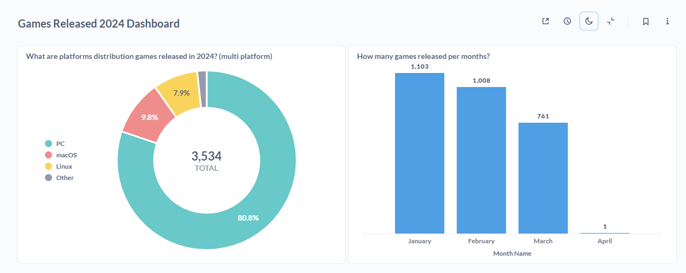

## End To End Data Pipeline Games Released 2024

### Mage Deploy to GCP with Terraform

https://docs.mage.ai/production/deploying-to-cloud/using-terraform

- Clone Mage Repo for deploying to GCP
- 1. login google cloud via cli :gcloud auth application-default login

2. change project id in variable
3. enable cloud filestore api :https://console.developers.google.com/apis/api/file.googleapis.com/overview?project=yourprojectid
4. terraform init
5. terraform plan
   6terraform apply

---

Mage AI hosted on Google Cloud: https://gengsudezoomcamp1-lhyfb2n2qq-wl.a.run.app

Metabase hosted on Google Cloud: https://gengsudezoomcamp1-metabase-lhyfb2n2qq-wl.a.run.app
 http://gengsudezoomcamp1-metabase-lhyfb2n2qq-wl.a.run.app/public/dashboard/2bf30e19-d241-4a67-9330-bab53c9706e4
